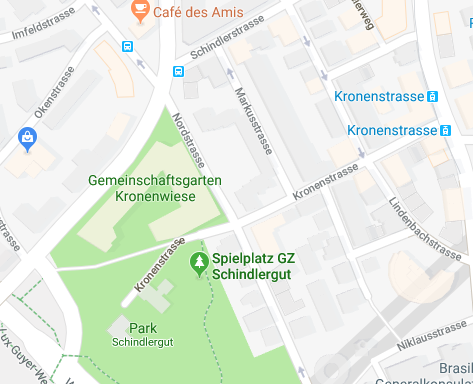
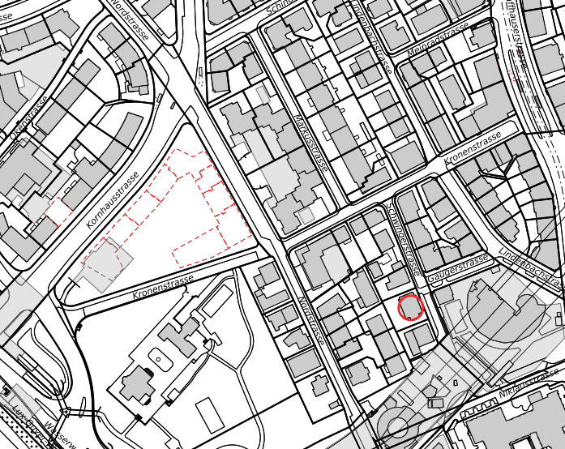
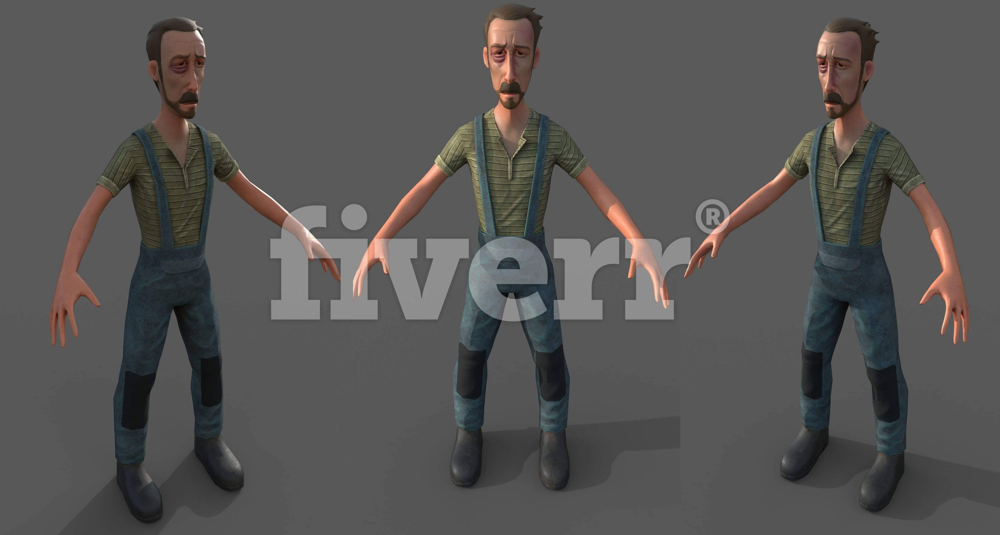

# Zurich 3D the prototype

This is the project description of the prototype for the Zurich 3D project.

## Motivation

In order to visualize simulations in 2D / 3D I searched for tools and I am referring to the Game Engine [Unity3D] (https://unity3d.com/unity), the [CityEngine] (https://www.esri.ch/de / products / cityengine) from Esri and the [GIS browser] (https://maps.zh.ch) of the city of Zurich.

<table style = "width: 100%">

  <Tr>

    <td>  </ td>

    <td>  </ td>

  </ Tr>

</ Table>

## idea

Since cities such as today's Zurich are in the focus of the simulation, it makes sense to build a prototype with the city's 3D data. The city model consists only of the blocks of the buildings with the roofs.

<table style = "width: 100%">

  <Tr>

    <td>  </ td>

  </ Tr>

</ Table>

So I would need a technology like [Computer Generated Architecture] (https://cehelp.esri.com/help/index.jsp?topic=/com.procedural.cityengine.help/html/manual/cga/basics/toc.html ) (CGA) of CityEngine use or develop yourself.

Outside | Courtyard | Architecture | night

------------ | ------------- | ------------- | -------------

 |  |  | 

* Otherwise it will be difficult to reach the goal within a reasonable time and with the financial means available to me. *

## Vision

Since Unity3D is a game engine, the following project idea was obvious: ** Simulation and Gamification Platform for Zurich in 3D **

Simulation | gamification

------------ | -------------

 | 

Some may now ask: * What does the ** social network ** look for there? *

The ** MRS Mind Research Systems GmbH ** has the purpose: ** Research of thoughts and feelings **

A social network is a memory ** for emotions ** that I want to try to visualize in 3D.

* A ** Like ** is not a differentiated emotional expression?

* What does a Like related to an image refer to?

Answering such and other questions is the purpose of the simulation.

With ** Zurich 3D ** you can also realize interesting game applications ... 😃

## Action

To handle such projects it is good to keep relevant literature. Because going wrong is still enough. 👻

* As a procedural model I use [Scrum] (https://www.scrumguides.org/docs/scrumguide/v1/scrum-guide-us.pdf).

* I adhere to [Fundamentals of Game Design] as a game development guide (http://ptgmedia.pearsoncmg.com/images/9780321929679/samplespages/0321929675.pdf).

* As a planning aid, I bought [How to Plan Game Environments and Level Designs] (https://www.worldofleveldesign.com/store/preproductionblueprint.php).

To do everything alone ** is not a good idea **. Freelancers can be found on platforms like [Upwork] (https://www.upwork.com). * Organizing some expertise can not hurt. * 😉

## inspiration

My biggest inspiration is my ** Mommy **, life in and of itself and of course ** Zurich **. Then come all the instructive and beautiful ** books ** that I was allowed to read. And of course the many ** dear friends ** who patiently listen to my displaced ideas and forgive me again and again when I knock the bottom out again. 🙏

## plan / team

The ** plan ** with a ** team ** from me and ** 3 experts ** in ** four weeks to develop the prototype for Zurich 3D **.

 

* ** Donat ** ▫️ Life Artist and Computer Scientist ▫️ ** Zurich **, Switzerland

* ** Leonard ** ▫️ 3D Content Creator, Animator and Effects Artist ▫️ ** Douala **, Cameroon

* ** Phil ** GIS, CityEngine Expert / Developer ** Kisumu **, Kenya

* ** Nirmla ** ▫️ Expert with wordpress / PHP, HTML / CSS3, SASS, Angular JS ▫️ ** Mandi **, India

## Project

The project ** prototype Zurich 3D ** takes ** a four weeks sprint **. Started on Monday ** 22.10.2018 ** and ends on Sunday ** 18.11.18 **.

### 💯 week 1

* Goal: To buy a [3D model of Zurich] (https://www.turbosquid.com/3d-models/zurich-cityscape-3d-dxf/946177) bought at TurboSquid for over $ 400.-. ** was unfortunately absolutely worthless see video report! **). Alternatively, download the data from the [GIS browser] (https://maps.zh.ch) and try to bring it to life in ** Unity3D **.

* Period: 22.10.2018 - 28.10.18

* Duration: 7 days

* Donat enough hours **

* Leonard 10 hours **

* 🥇 Success: 100%

* Summary: The TurboSquid model was a total junk, which luckily I got refunded. ** Leonard ** 👱 joined the team and sent a video report on the 💩 model of TurboSquid as [Video Report] (https://www.youtube.com/watch?v=gJH0NMV72y8).

***

### 💯 week 2

* Goal: Combine data from OpenStreetMap and GIS browser and show it in Unity3D (80% of the time). First demo scene build in Unity3D (20% of the time).

* Period: 29.10.2018 - 04.11.18

* Duration: 7 days

Donat enough hours

* Leonard ** 40 ** hours

* 👍 Success: 80%

* Summary: I have not yet been able to organize the city's data as a 3D model in a file / archive. Leonard has sent a video report of his second week as [Video Report] (https://www.youtube.com/watch?v=zpmHGtxzrP4). There were still too many open questions about the data and how to generate the facades to clarify why the demo scenes could not be shown.

***

### 💯 week 3

* Objective: Organize the city model Zurich 3D. Check [CityEngine] (https://www.esri.com/en-us/arcgis/products/esri-cityengine/overview) for options and licensing costs at [Esri] (https://www.esri.ch) Switzerland , Find a GIS and CityEngine expert as a freelancer. Contact Zurich artists such as illustrators, 3D animation professionals or film producers. Find employees for 3D modeling, cartoon & anime draftsman as well as draftsman for 2D to 3D model conversion. Visit of a 3D body scanner and plastic figure printing service in Zurich. Create a bookmark collection for all the 3D, Unity animation sources on the internet. Buy and read books about animation, character style, architecture and design.

* Period: 05.11.2018 - 11.11.18

* Duration: 7 days

Donat enough hours

* Leonard ** 7 ** hours

* Phil ** 28 ** hours

* 🥇 Success: 100%

* Summary: [3D city model OGD] (https://data.stadt-zuerich.ch/dataset?q=3D+city+model+OGD) (1.5 GB tar file). CityEngine Advanced (demo license 30days trial). ** Phil ** 👱 joined the team.

Visited or phoned with:

* [Christian Zogg] (http://www.christianzogg.com) (Zurich).

* [Florian Baumann] (http://www.florianbaumann.com/about/) (PULK Zurich).

* [Lilou Studio] (http://www.liloustudio.com/3D_animation/index.php) (Margit Games Zurich).

* [Mookx] (http://www.mookx.nl) (Amsterdam).

* Daniel Hovatis (Graz)

* [Gorille] (http://gorille.co) (Paris)

Bookmarks collected: [Wiki Animation 3D] (https://github.com/mind-research-systems/zuerich/wiki/Animation-3D-Bookmarks)

***

### 💯 week 4

* Target: Retro of the last four weeks. Re-planning until the end of November 2018. Improve documentation quality. Create demo scenes [Schindlerpark](https://www.google.ch/maps/place/Schindlergut/@47.3864388,8.5339195,17z/data=!3m1!4b1!4m5!3m4!1s0x47900a0d28ecddf5:0x9d56e4a79c4143ef!8m2!3d47.3864388!4d8.5361082), [Limmatplatz](https://www.google.ch/maps/place/Limmatpl.,+8005+Zürich/@47.3844261,8.5294995,17z/data=!3m1!4b1!4m5!3m4!1s0x47900a12589a41d7:0x2beaee1b7214c23e!8m2!3d47.3844225!4d8.5316935) or [Escher-Wyss-Platz](https://www.google.ch/maps/place/Escher-Wyss-Platz,+8005+Zürich/@47.3910482,8.5200328,17z/data=!3m1!4b1!4m5!3m4!1s0x47900a41c5a22331:0x5a85c425ae122858!8m2!3d47.3910446!4d8.5222268), [Kornhausbrücke](https://www.google.ch/maps/place/Kornhausbrücke,+Zürich/@47.3857063,8.5309521,17z/data=!3m1!4b1!4m5!3m4!1s0x47900a12a474e059:0x228d28bb36797350!8m2!3d47.3857027!4d8.5331461). 

* Duration: 7 days

Donat enough hours

* Leonard ** 40 ** hours

* Phill ** 39 ** hours

* Nirmla ** 2 ** hours

* Period: 12.11.2018 - 18.11.18

* 🥇 Success: 100%

* Summary: ** This project documentation ** and joined the team ** Nirmla ** 👩.

***

## Residents of Zurich 3D

I proudly introduce you to our first inhabitant

### Philip & da Goose

2D Grafity (Zurich Latvia) | Interpretation Zurich 3D

------------ | -------------

 | 

More on ** zuerich3D.org ** ✌️🌸 soon

